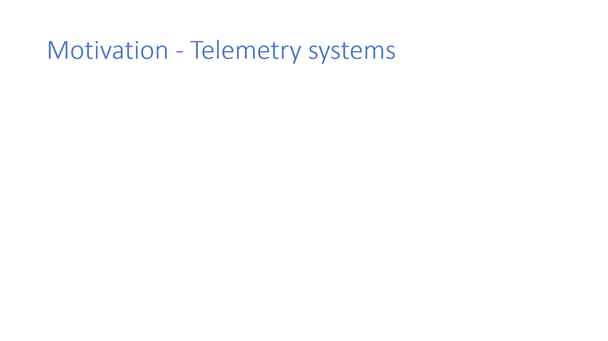
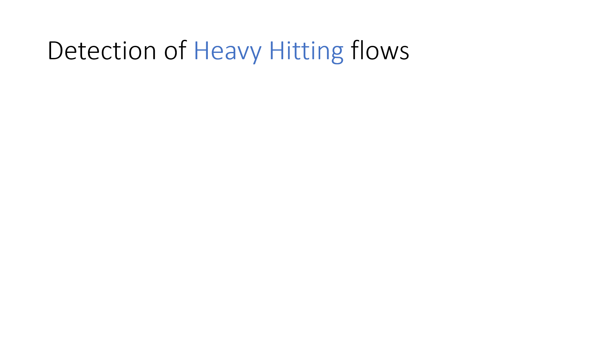
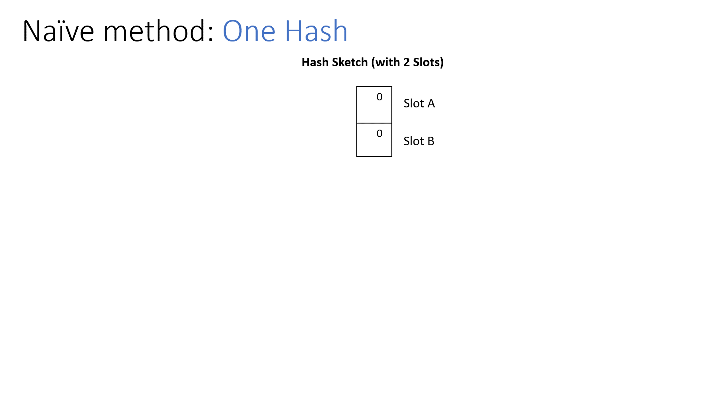
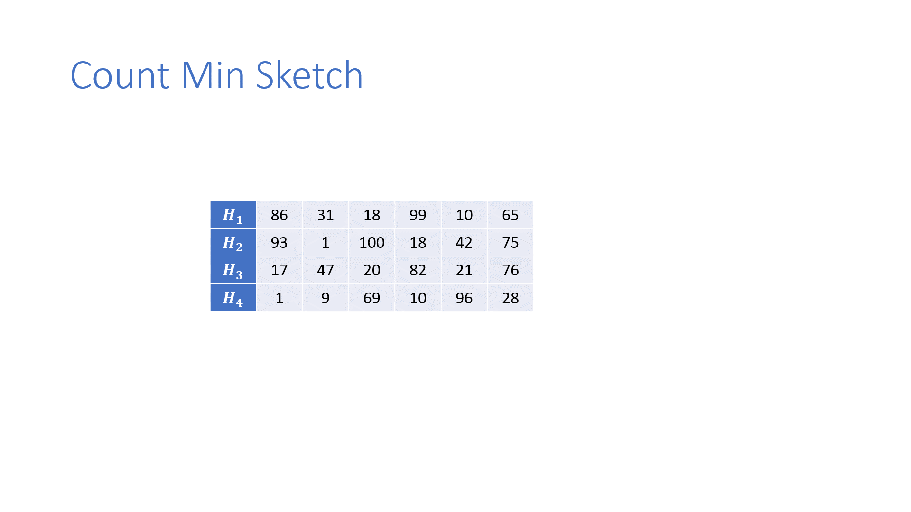
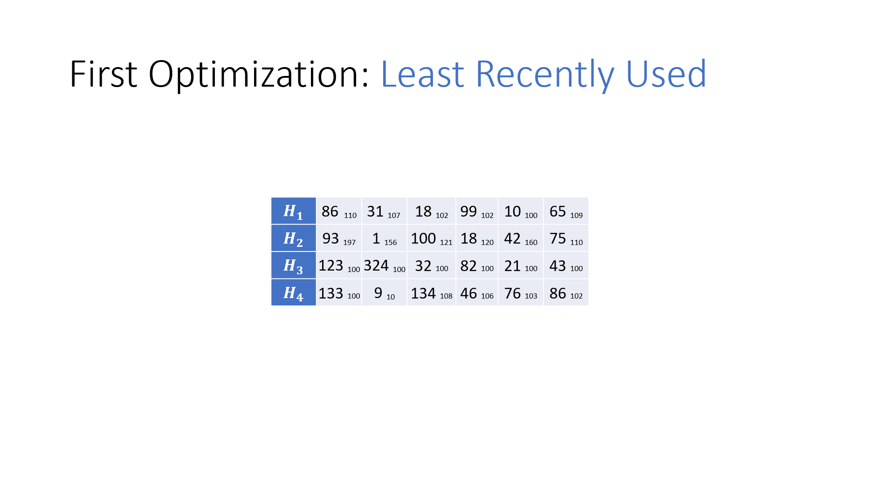
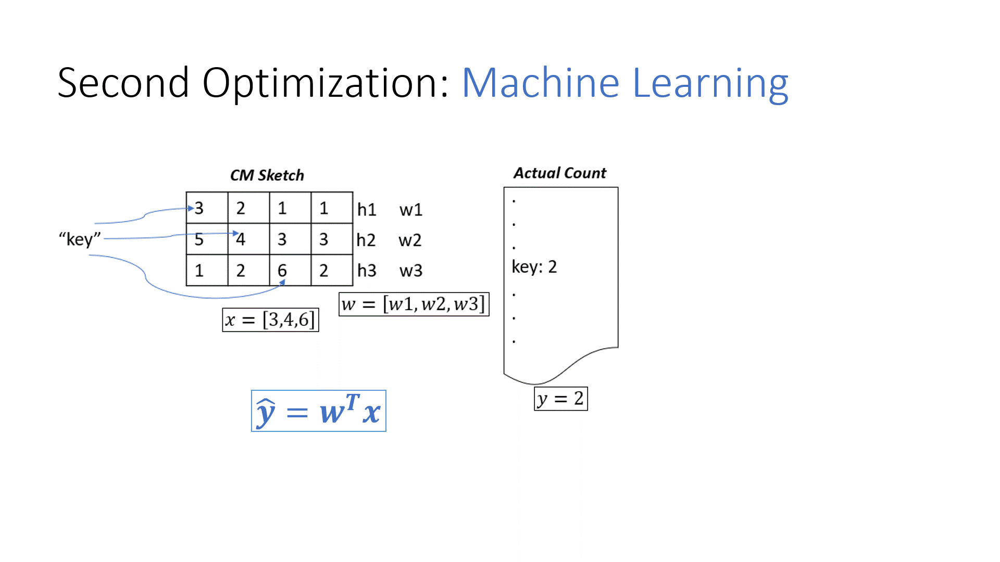

# Switch-Aid: Accurately identifying heavy hitting flows

Our project Switch Aid, aims to improve the accuracy of heavy hitter detection in network traffic.

## Motivation

There are multiple telemetry systems which are used to detect anomalies in networks. These systems need to perform in real-time to instantly alert the datacenter managers about relevant details, so that they can take the necessary steps required. Anomalies include security vulnerabilities DDoS attacks, Port Scan Attacks, or might include Load Balancing.
As anomaly detection needs to be in real-time, we need to address this in the data-plane, which is heavily resource constrained due to line-rate operation capabilities. We cannot afford to do this in the control plane and inter-plane messages are very expensive.

## Project Scope

For our project we focused on detection of Heavy Hitting Flows.

In packet switching networks, network flow is a sequence of packets from a source computer to a destination. Unique flows are identified by a 5-tuple value, which is basically the Source IP, Destination IP, Source Port, Destination Port, and Protocol.

Heavy Hitters are such flows which have a large amount of packets. In this example, Outside Computer 1 sends packets into the network @1M Pkts/s. This might quickly lead to network congestion, if not mitigated or load-balanced quickly.

The switch here identifies the heavy hitter flows, sends them to the monitoring services and offloads further packets from that host to the orange line in the slide.

## Naïve Method

The naïve method to is using a hash function to hash the unique flow IDs, and to maintain a flow counter for each such flow. Using this architecture, we can basically get 100% accuracy in Heavy Hitter detection if we have a large enough hash bucket.

But since on a typical edge switch the number of flows that pass through the switch are in billions it is not feasible to store the state information (i.e the exact flow count in a hash map) considering the space limitations on a switch. So this is where the scientific community has adopted approximate methods to estimate the flow size, and the most basic solution was to use a limited size hash table.

Though this method solves the problem of using limited space to calculate the flow sizes, the error rates of the method will be very high if the number of flows is much higher than the hash table size, due to the fact there is a chance of multiple flows getting mapped to the same hash table entry, which are hash collisions.

## Count-Min Sketch

The Count-Min Sketch, or CMS for short, is a data structure that solves the prior problem that we faced in an approximate way, using probabilistic techniques. It has “d” pairwise independent Hash Functions, and each flow ID is hashed, and the corresponding indexes are updated. The final count which we need during query is given by this formula.

$$\min_{1 \leq i \leq d} count [H_i(a)]$$

With this basis, can we do better? We have come up with 2 optimizations over CM Sketch.
Challenges to keep in mind ->
1.	Increase throughput
2.	Lower memory footprint
3.	Increase accuracy
4.	Do everything on the Data Plane

# Optimizations

## LRU

In the basic CM Sketch, since the counters are never cleared, and multiple flows can be mapped to a single cell, we will have false positives where an incorrect flow is misattributed to have a large packet count. We cannot blindly clear the table, so we can try LRU as an eviction policy, in the counters so that some hash collisions can be intelligently minimized. The intuition here is that since Heavy Hitters are huge packet traffic patterns, we would most likely see these packets very frequently, and this LRU would not incorrectly throw them out.

## Machine Learning

We also tried to model this as a simple Linear Regression problem.

For a particular packet, the “d” hashes are calculated and we get the corresponding counter values for them. These would be the input variable, or “x”. We already found the ground truth values for our query counter values by processing our dataset.

This now reduces to a supervised learning problem, Linear Regression in our case, where we train the weight vector “w”.

Once trained, we can get our CM Sketch “query” value by running this equation here, as is done in traditional Linear Regression.

$$ \hat{y} = w^T x $$

This effectively replaces the querying method that we use in CM Sketch with a ML regression inference.

## Evaluations

| **Methods**              | **Storage Footprint (MB)** | **Accuracy at 95 Percentile** | **Accuracy at 99 Percentile** |
|--------------------------|----------------------------|-------------------------------|-------------------------------|
| **Baseline**             |                            |                               |                               |
| One Hash         | 256                        | 6.67                          | 4.42                          |
| CM Sketch        | 256                        | 95.12                         | 97.76                         |
| **Optimizations**        |                            |                               |                               |
| LRU              | 512                        | 66.33                         | 97.67                         |
| Machine Learning | 256                        | 99.56                         | 99.12                         |
